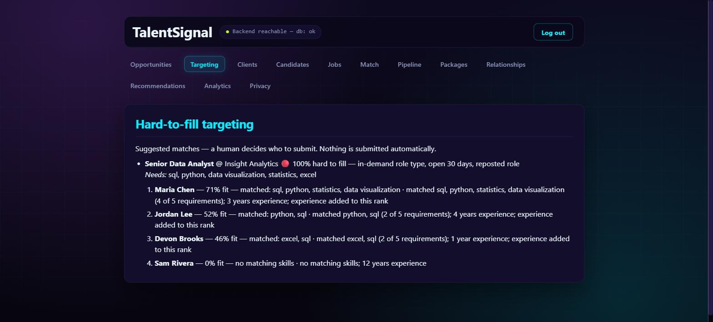

# HF-3 — Hard-to-fill targeting (match students to submit)

*Live demo (Docker stack): for the hard-to-fill Senior Data Analyst opening, the students
best matched to submit — ranked, each with matched skills and reasons — under an explicit
"a human decides who to submit; nothing is submitted automatically" note. No submit control
exists on the screen.*

**Status:** Built & verified (2026-08-18). Backend 264 tests pass, frontend 37 pass, both
typechecks clean; verified live end-to-end (Maria Chen 71% → Sam Rivera 0% for the data
analyst role). Two assumptions **PROPOSED, cleared to proceed for now**: the role→skills map
(decision 027) and "students = the candidates in the system" (build-out doc).

## What it does (plain English)
The payoff of Ali's ask — the "which students to submit" part. A new **Targeting** screen
lists every hard-to-fill opportunity and, for each, the students best matched to it: ranked
by fit, each with the skills they matched and a plain-English reason. **Advisory only** — a
suggestion a human acts on, never an automated submission.

## The design problem it solved
`scoreCandidate` (S-11) ranks candidates against a job's **required skills**, but a
hard-to-fill *opportunity* is a market signal — company + role title, no skills — and
decision 015 refused to invent an opportunity↔job link. Two small, honest bridges:
1. **Persist the role title** on the opportunity (migration 014) — never stored before.
2. **A PROPOSED role→skills map** (`roleSkillsConfig.ts`, decision 027) turning a role type
   into representative required skills. It *imports* HF-1's keyword list, so a title
   resolves to the same role HF-1 flagged — one source of truth.

`scoreCandidate` is reused **unchanged** — the same ranker `clientMatchmaking.ts` /
`recommendationEngine.ts` use.

## Trust scenario: advisory, not automated
`GET /hard-to-fill/targeting` is **read-only** — only SELECTs, never INSERT/UPDATE/DELETE,
and **no submit path** in the router or the screen. `suggestion: true` is part of the
contract. A backend test asserts the route only SELECTs; a frontend test asserts the screen
has no submit button. REQ-020 ("AI drafts and suggests; a human reviews and releases")
enforced in code.

## Tests
- Backend `hardToFillTargeting.test.ts` (7): ranked students with reasons; only flagged
  roles listed; read-only/no-write trust test; idempotent; empty; RBAC; 500 on DB failure.
- Backend `roleSkills.test.ts` (5): title→role→skills, case-insensitive/substring, unknown
  → empty, punctuation limitation, and every keyword has a skills entry.
- Frontend `HardToFillTargeting.test.tsx` (5): renders role + students + reasons; advisory
  note present and **no submit control**; empty/expired/error states.

## Still open (flagged, not guessed)
Role→skills values (027) and "students = candidates" are PROPOSED pending Ali. Skill match
inherits `scoreCandidate`'s exact-string limitation. Real requirements could later come from
job descriptions instead of the static map — swaps the bridge without touching route/scorer.

## What this completes
HF-1 (detect) → HF-2 (surface) → **HF-3 (act)**. The demo now tells Ali's whole story: spot
hard-to-fill roles, show sales, and name the students to submit — human always in the loop.
