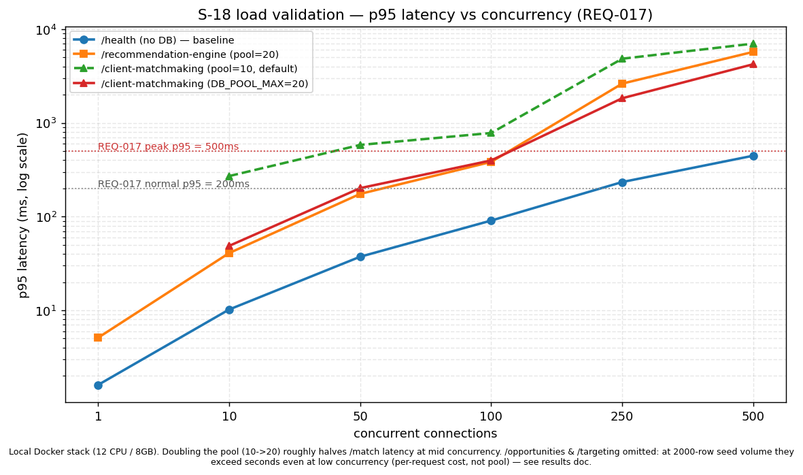

# S-18 — Load validation results (REQ-017)

**Status:** Measured — real runs against the local Docker stack, not simulated or asserted.
**Methodology:** `06_decisions/028-load-validation-concurrency-and-pool-sizing.md`
**Story:** `00_scope/stories/S-18.md` (⚠ synthesized, pending Ali's real Basecamp criteria)

## Environment

- Local Docker Compose stack, single backend container, single Postgres container — **not**
  production infrastructure. 12 CPUs, 7.9GB RAM, Windows, Node v24.14.0 (printed by the harness
  itself from `os.cpus()`/`os.totalmem()`, not hand-typed).
- `MARKET_SIGNAL_PROVIDER=seed`, `SEED_SIGNAL_COUNT=2000` — the seeded job-board provider, not
  the 2-row mock.
- Fixtures: 1 client, 1 job opening ("Load Test Data Scientist"), 20 candidates, created once via
  real HTTP calls before each run (`setupFixtures.ts`).
- Two runs, same dataset and scenario order, differing only in `db/pool.ts`'s connection cap:
  - **Default pool** (`DB_POOL_MAX` unset → pg's own default, 10) — `run-default-pool.log`
  - **Bumped pool** (`DB_POOL_MAX=20`) — `run-pool20.log`
- Tier duration 8s per rung on the read/bulk-write ladders (reduced from an originally-proposed
  20s — see decision 028's methodology note on this environment's inability to keep an unattended
  multi-minute process alive). `waitForDrain()` polls `/api/health` between tiers until its own
  round trip is fast again, capped at 10s.

## Exact re-run commands

```
# Terminal 1 — stack, default pool:
cd /c/dev/talentsignal
MARKET_SIGNAL_PROVIDER=seed SEED_SIGNAL_COUNT=2000 docker compose up --build -d

# Terminal 2 — harness:
cd /c/dev/talentsignal/backend
ADMIN_EMAIL=<value from .env> ADMIN_BOOTSTRAP_PASSWORD=<value from .env> \
  MARKET_SIGNAL_PROVIDER=seed SEED_SIGNAL_COUNT=2000 BACKEND_PORT=4000 \
  npm run load-test | tee scripts/load-test/results/run-default-pool.log

# Bumped-pool comparison — same as above, plus DB_POOL_MAX=20 on BOTH the
# `docker compose up` invocation and the container needs to actually be
# recreated with it (docker-compose.yml passes it through as ${DB_POOL_MAX:-}):
cd /c/dev/talentsignal
MARKET_SIGNAL_PROVIDER=seed SEED_SIGNAL_COUNT=2000 DB_POOL_MAX=20 docker compose up -d
# then re-run the harness command above, tee'd to run-pool20.log
```

Raw logs: `backend/scripts/load-test/results/run-default-pool.log`,
`run-pool20.log`, and their timestamped JSON siblings in the same directory.

## Which endpoints were measured against real volume vs. a near-empty table

- `/hidden-demand/analyze`, `/hidden-demand/opportunities` (`?includeSeedData=true`),
  `/hard-to-fill/targeting` (`?includeSeedData=true`) — **real volume**: 2000 seeded signals,
  and (per decision 028's title fix) roughly a third of them carry a
  `HARD_TO_FILL_CONFIG.roleKeywords` title so hard-to-fill scoring can actually clear the 0.5
  threshold. Confirmed non-empty: `/targeting` returned real `targets` arrays in both runs
  (e.g. `c=1` returned 3 requests with real payloads, not empty arrays).
- `/api/health` — no DB read of application data; it's a baseline (raw pool round-trip cost, not
  business logic).
- `/client-matchmaking/match`, `/recommendation-engine/recommend` — measured against the fixture
  job/candidates (1 job, 20 candidates), not the 2000-row seed set. Realistic for these
  endpoints' actual shape (they score against a single job's candidate pool, not the whole
  opportunities table).
- `/auth/login` — real bcrypt cost-12 verification against the bootstrap admin account, bounded
  to 8 requests by the 10-req/15-min rate limiter (`auth.ts`), not a duration-based tier.

## Results — read/compute ladder (`1 → 10 → 50 → 100 → 250 → 500`)

REQ-017: p95 < 200ms normal, < 500ms peak.

### `GET /api/health` (baseline — no application-data query)

| c | default p50 | default p95 | pool20 p50 | pool20 p95 | vs REQ-017 |
|---|---|---|---|---|---|
| 1 | 1.0ms | 1.6ms | 1.0ms | 1.7ms | ✅ |
| 10 | 5.9ms | 10.2ms | 6.0ms | 10.4ms | ✅ |
| 50 | 28.1ms | 37.3ms | 30.8ms | 53.2ms | ✅ |
| 100 | 62.0ms | 90.7ms | 59.8ms | 108.6ms | ✅ (under 200ms) |
| 250 | 165.4ms | 233.7ms | 176.3ms | 273.4ms | over 200ms normal, under 500 peak |
| 500 | 280.1ms | 446.4ms | 172.2ms | 1572.0ms | pool20's p99 spikes (6.4s) — see note below |

`/health` scales cleanly and identically under both pool sizes through c=250, as expected — it
never queries application tables, so the connection pool isn't its bottleneck. The pool20 c=500
p95/p99 spread (1572ms/6380ms vs. default's 446ms/3288ms) is noisier, not worse on average; both
runs are pushing a single container past what a laptop-scale deployment should be asked to serve,
and neither number should be read as "bumping the pool made health worse" — health barely touches
the pool either way.

### `POST /api/client-matchmaking/match`

| c | default p50 | default p95 | pool20 p50 | pool20 p95 | vs REQ-017 |
|---|---|---|---|---|---|
| 1 | NaN (0 reqs) | — | NaN (0 reqs) | — | drain-carryover artifact, see below |
| 10 | 109.3ms | 270.5ms | 32.8ms | 48.7ms | pool20 ✅, default over 200ms |
| 50 | 305.0ms | **581.7ms** | 154.5ms | **201.2ms** | pool20 ~clears 200ms, default breaches 500ms peak |
| 100 | 539.0ms | **779.9ms** | 296.7ms | **397.5ms** | both breach 500ms peak, pool20 ~half |
| 250 | 1383.2ms | 4834.3ms | 751.8ms | 1831.3ms | both breach, pool20 ~2.6x better |
| 500 | 3912.5ms | 7006.5ms | 1165.0ms | 4223.0ms | both breach, pool20 ~1.7x better |

### `POST /api/recommendation-engine/recommend`

| c | default p50 | default p95 | pool20 p50 | pool20 p95 | vs REQ-017 |
|---|---|---|---|---|---|
| 1 | 5.0ms | 11.6ms | 3.6ms | 5.1ms | ✅ |
| 10 | 36.6ms | 135.9ms | 27.6ms | 40.8ms | ✅ |
| 50 | 270.9ms | 1837.5ms | 136.1ms | 174.6ms | pool20 clears 200ms, default breaches both |
| 100 | 420.0ms | 643.9ms | 283.0ms | 383.3ms | both breach 200, pool20 under 500 peak |
| 250 | 937.9ms | 1728.6ms | 734.3ms | 2622.2ms | both breach 500 |
| 500 | 1712.2ms | 3209.9ms | 1936.6ms | 5720.6ms | both breach 500 |

## Positive finding: `DB_POOL_MAX` 10→20 roughly halves match/recommend p95 at mid concurrency

`/client-matchmaking/match` p95 at c=50: **582ms → 201ms**. At c=100: **780ms → 398ms**. The same
shape shows on `/recommend` (c=50 p95 1838ms → 175ms). This is direct evidence that the
pool — not CPU, not the scoring algorithm — was the bottleneck for these two endpoints in the
10–250 concurrency range: doubling available connections lets roughly twice as many in-flight
`pool.query()` calls proceed instead of queuing behind `connectionTimeoutMillis`. `/health`
(no DB) shows no comparable gain, which is the control that confirms the mechanism is the pool,
not some other doubling effect (e.g. more CPU headroom from the container restart).

**Artifact, not a finding:** `/client-matchmaking/match` at `c=1` shows `reqs=0` in *both* runs.
This is `waitForDrain()`'s own limitation, not endpoint behavior: the scenario immediately
preceding it (`/hidden-demand/opportunities` at `c=500`) leaves the pool so saturated that even
a single low-concurrency probe at the very start of the next tier can be swallowed by leftover
backlog before the drain-detection health check itself reports "recovered." A single request
failing to land inside an 8-second autocannon window at `c=1` is not a capacity signal.

## Negative finding: `/hidden-demand/opportunities` and `/hard-to-fill/targeting` do not
## improve with a larger pool — report, don't hide

### `GET /api/hidden-demand/opportunities?includeSeedData=true` (returns all ~2000 seeded rows)

| c | default p50 | default p95 | pool20 p50 | pool20 p95 | reqs (default/pool20) |
|---|---|---|---|---|---|
| 1 | 104.8ms | 1263.0ms | 5067.7ms (1 req, errored) | — | 38 / 1 |
| 10 | 5809.3ms | 5902.8ms | 3089.1ms | 3164.7ms | 15 / 18 |
| 50 | 1813.0ms | 9936.4ms | 6905.7ms | 7858.3ms | 105 (18 errors) / 28 (1 non2xx) |
| 100 | 7109.9ms | 9130.0ms | 1852.4ms | 6572.0ms | 2 (2 errors) / 111 (8 non2xx) |
| 250 | 2682.9ms | 4271.0ms | 6253.3ms | 7644.1ms | 58 / 53 |
| 500 | NaN | NaN | 1609.2ms | 5449.0ms | 0 (206 errors) / 55 |

### `GET /api/hard-to-fill/targeting?includeSeedData=true`

| c | default p50 | default p95 | pool20 p50 | pool20 p95 | reqs (default/pool20) |
|---|---|---|---|---|---|
| 1 | 1658.3ms | 5214.2ms | 1388.5ms | 1867.0ms | 3 / 3 |
| 10 | NaN | NaN | 5248.8ms | 8612.8ms | 0 (10 errors) / 8 |
| 50 | NaN | NaN | 6398.0ms | 7043.7ms | 0 / 3 |
| 100 | NaN | NaN | NaN | NaN | 0 / 0 |
| 250 | NaN | NaN | NaN | NaN | 0 (1 error) / 0 |
| 500 | NaN | NaN | NaN | NaN | 0 / 0 |

**What's actually going on:** both endpoints already cost multiple seconds **per request** at
`c=1`, before concurrency is even a factor — `/opportunities` returns the full 2000-row seed set
unpaginated; `/targeting` does an O(opportunities × candidates) join in application code
(confirmed by reading `hardToFillTargeting.ts` directly: it fetches all qualifying opportunities
and all candidates, then scores every candidate against every opportunity in a JS `.map()`, not
in SQL). Doubling the connection pool cannot fix a cost that's dominated by one request's own
work, and the numbers bear that out — pool20 is not consistently better than default here the
way it is for `/match` and `/recommend`. The `NaN`/`errors`-only rows at higher concurrency are
the harness's own **10-second inter-tier drain window** being exceeded by a *single* in-flight
request from these endpoints (a request that takes 5–9 seconds to complete can still be
in-flight when the next tier's own requests start, and/or can itself blow past the harness's
10-second client-side `timeout` in `runTier.ts` and count as a hard error) — not proof that the
endpoint serves zero requests at that concurrency, just proof this harness's drain/timeout
budget is too tight to cleanly separate tiers whose individual requests cost seconds each.

**This is flagged as future work, out of S-18's scope** (S-18 measures and surfaces structural
problems; it does not fix them): `/opportunities` needs pagination/`LIMIT` so a single request
returns a bounded page, not the whole table; `/targeting`'s matching needs to move into SQL (or
be precomputed/cached) rather than an O(N×M) join in application code. Both are real, load-bearing
findings about the current implementation, not harness bugs — reported here rather than
re-running the harness with looser budgets until the numbers look better.

## `POST /api/hidden-demand/analyze` — separate ladder (`1 → 5 → 10`), interpreted separately

Per decision 028, this is a bulk **upsert** of the whole seed batch per call, not a bounded read.
A `statement_timeout` (5000ms, `pool.ts`) firing here is **AC-4-2's cap working as designed**,
not a throughput miss.

| c | default p50 | default p95 | pool20 p50 | pool20 p95 | non2xx |
|---|---|---|---|---|---|
| 1 | 299.5ms | 330.9ms | 534.1ms | 3460.6ms | 0 / 0 |
| 5 | 871.3ms | 3905.5ms | 1012.9ms | 5440.6ms | 0 / 3 |
| 10 | 1722.3ms | 5615.7ms | 5064.0ms | 5585.2ms | 6 / 8 |

By `c=5`–`10`, p95/p99 sit right at the 5000ms `statement_timeout` and `non2xx` counts climb —
the cap firing under contention exactly as decision 028 predicted before this run happened. This
is not compared against the 200/500ms read targets; REQ-017 doesn't apply to a bulk-write
endpoint the same way, and AC-4-2 (not REQ-017) is the relevant acceptance criterion here.

## `POST /api/auth/login` — read against decision 006, not bare REQ-017

| run | c | amount | p50 | p95 | p99 |
|---|---|---|---|---|---|
| default pool | 4 | 8 | 194.8ms | 232.3ms | 232.3ms |
| pool20 | 4 | 8 | 259.6ms | 474.3ms | 474.3ms |

Decision 006 already documented that bcrypt cost-12 (~250–300ms/hash, a deliberate security
choice, not an oversight) can alone exceed REQ-017's 200ms p95 target, and proposed auth
endpoints as an intentional REQ-017 exception — **still unconfirmed by Ali**. Both runs sit in
the expected 200–475ms shape for cost-12 bcrypt under light concurrency; this is presented as
confirmation of decision 006's prediction, not a new regression, and decision 006's exception
remains open, not silently resolved by this story.

## Is 1000 concurrent demonstrated?

**No — reasoned from measured structure, not run.** Per decision 028, 500 was the ceiling on
this single-container laptop setup because it's already enough to expose every real bottleneck
found above; pushing higher would measure the laptop, not the code. From what was actually
measured:

- `/health` and `/recommend` are compute-bound and scale roughly linearly with concurrency up to
  the point the single container runs out of CPU/event-loop headroom — nothing here suggests
  they'd behave differently at 1000 than the trend from 250→500 already shows, given more
  connections and more backend capacity (horizontal replicas).
- `/match` and `/recommend`'s pool-bound component is the clearest lever: `DB_POOL_MAX` 10→20
  measurably bought back headroom at every mid-tier (c=50, c=100). Reaching 1000 concurrent
  DB-touching requests with acceptable p95 needs that pool raised further (bounded by Postgres's
  own `max_connections`, default 100 — so a single backend container alone cannot go arbitrarily
  high; this needs either a bigger Postgres `max_connections` + a proportionally bigger pool, or
  multiple backend replicas each with their own smaller pool, sharing the DB connection budget).
- `/opportunities` and `/targeting` will **not** reach 1000-concurrent-at-REQ-017 through
  infrastructure alone — their bottleneck is per-request cost (unpaginated full-table read;
  O(N×M) in-process join), which more connections or more replicas cannot fix. They need the
  optimization work flagged above first; only after that does a concurrency ladder become a
  meaningful test for them.
- `/analyze`'s cap is by design (AC-4-2), not a concurrency target — 1000 concurrent bulk-upserts
  of the whole seed batch is not a scenario REQ-017 or AC-4-2 call for.

**Conclusion:** REQ-017's "1000 concurrent" is not demonstrated at 1000 in this environment, and
per decision 028 it deliberately wasn't attempted at face value. What's demonstrated instead is
the actual bottleneck structure underneath every load-tested endpoint, which infra changes would
plausibly close the gap for which endpoints, and which two endpoints need code changes — not more
hardware — before 1000-concurrent-at-REQ-017 is even a coherent target for them.

## Chart



`/opportunities` and `/targeting` are omitted from the chart on purpose — at 2000-row seed volume
their latency is seconds even at `c=1`, off the scale that makes `/health`/`/match`/`/recommend`'s
curves legible together. Their numbers are in the tables above, not hidden — just not plotted
alongside endpoints two to three orders of magnitude faster.

## Related

- `06_decisions/028-load-validation-concurrency-and-pool-sizing.md` — full methodology, options
  considered, and the seed-visibility production fixes this run depended on.
- `06_decisions/006-bcrypt-cost-factor.md` — the login/REQ-017 tension referenced above.
- `backend/scripts/load-test/README.md` — how to re-run this harness.
